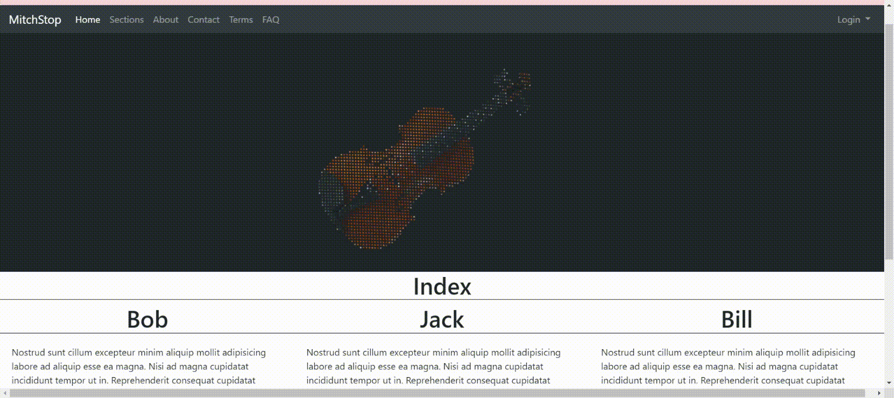

# particleHeader



- [particleHeader](#particleheader)
    - [Installation](#installation)
    - [Usage](#usage)
    - [Example](#example)
    - [Django-mako-plus Installation](#django-mako-plus-installation)
    - [Django-mako-plus Usage](#django-mako-plus-usage)
    - [Django-mako-plus Example](#django-mako-plus-example)

## Installation

- Clone this repository into your project folder
  > git clone <https://github.com/sottom/particleHeader.git>

## Usage

- Add link to the particleHeader library in the \<head> tag of your html document

    ```html
    <head>
        <script src="/particleHeader.js"></script>
    </head>
    ```

- Add canvas element to the top of your body

    ```html
    <body>
        <!-- must have id="canvas" -->
        <canvas id="canvas"></canvas>
    ```

- Add call to particleHeader() function immediately before the ending \<\/body> tag
    ```html
        <!-- add path to the image your want to render as a parameter -->
        <script>
            particleHeader('/path/to/image')
        </script>
    </body>
    </html>
    ```

## Example

```html
<!DOCTYPE html>
<html lang="en">
<head>
    <meta charset="UTF-8">
    <meta name="viewport" content="width=device-width, initial-scale=1.0">
    <meta http-equiv="X-UA-Compatible" content="ie=edge">
    <title>Particle Header</title>

    <!-- link to particleHeader library -->
    <script src="/particleHeader.js"></script>
</head>
<body>
    <!-- canvas element with id="canvas" -->
    <canvas id="canvas"></canvas>

    <!-- call to particleHeader() function with img path as parameter -->
    <script>
        particleHeader('/img/467-saxophone.png')
    </script>
</body>
</html>
```

## Django-mako-plus Installation

- Clone this repository into your root folder (same folder as your apps)
  > git clone <https://github.com/sottom/particleHeader.git>

## Django-mako-plus Usage

- Add link to the particleHeader library in the \<head> tag of your html document

    ```html
    <head>
        <!-- particle header library -->
        <script type="text/javascript" src="${ STATIC_URL }particleHeader/particleHeader.js"></script>
    </head>
    ```

- Add canvas element to the top of your body (or right under your navbar)

    ```html
    <body>
        <!-- must have id="canvas" -->
        <canvas id="canvas"></canvas>
    ```

- Add call to particleHeader() function immediately before the ending \<\/body> tag
    ```html
        <!-- add path to the image your want to render as a parameter -->
        <script>
            particleHeader('${ STATIC_URL }path/to/image')
        </script>
    </body>
    </html>
    ```

## Django-mako-plus Example

```html
<!DOCTYPE html>
<html lang="en">
<head>
    <meta charset="UTF-8">
    <meta name="viewport" content="width=device-width, initial-scale=1.0">
    <meta http-equiv="X-UA-Compatible" content="ie=edge">
    <title>Particle Header</title>

    <!-- link to particleHeader library -->
    <script type="text/javascript" src="${ STATIC_URL }particleHeader/particleHeader.js"></script>
</head>
<body>
    <!-- canvas element with id="canvas" -->
    <canvas id="canvas"></canvas>

    <!-- call to particleHeader() function with img path as parameter
    NOTE: this is an example path to an image. You will have to go get your own image and save it into your project -->
    <script>
        particleHeader('${ STATIC_URL }fomo_app/media/img/cello.jpg')
    </script>
</body>
</html>
```
